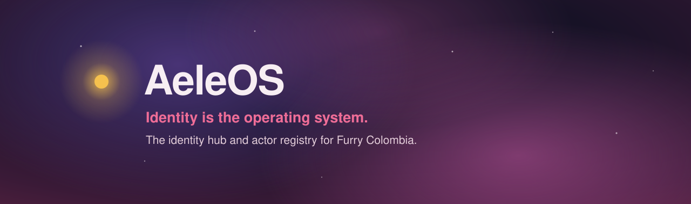
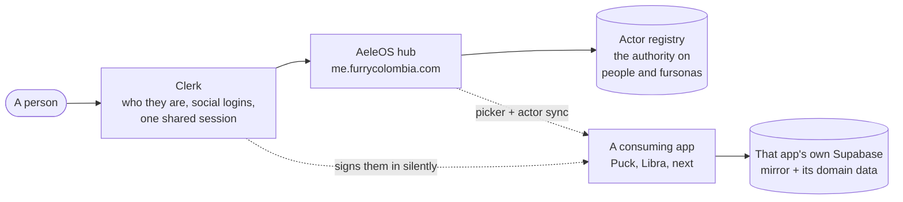

<p align="center">
  
</p>

<h1 align="center">AeleOS</h1>

<p align="center">
  <strong>Identity is the operating system.</strong><br>
  The identity hub and actor registry for Furry Colombia.
</p>

<p align="center">
  <a href="https://me.furrycolombia.com"></a>
  <a href="https://github.com/vaoan/AeleOS/actions"></a>
  
  
</p>

One person carries **one login and every fursona** across the platform, while
each app keeps its own database. AeleOS is where somebody signs in, decides who
they are, and builds the page a stranger reads — and it is the one place social
logins are configured for everybody.

**[Open the hub →](https://me.furrycolombia.com)** · **[Integrate an app →](docs/integrating.md)** · **[Explore the architecture →](docs/superpowers/specs/2026-07-26-aeleos-central-auth-design.md)**

> **On the name.** Furry Colombia's apps are moons — **Puck** orbits Uranus,
> **Janus** orbits Saturn. AeleOS is the star they orbit, which is literally the
> dependency graph: everything depends on identity. The word is the founder's
> fursona _Aeleos_ + `OS`.

---

## What ships today

- **Sign in once, and be somebody.** Clerk-backed sign-in with Google and
  Discord, and a person actor provisioned on the first visit.
- **One registry for a person and their fursonas.** The authoritative record of
  who exists and who owns whom, shared by every app.
- **A studio for building a page.** Sections are containers of places holding
  content or more containers, three deep, arranged by dragging with a mouse or
  a keyboard — plus skins, borders, widths, backgrounds and per-item bilingual
  fields.
- **Public pages anybody can read.** `/{person}` is somebody's profile and
  `/{person}/{fursona}` is one of their characters. A person's permanent number
  and their vanity both resolve forever, so a shared link never rots.
- **Bilingual, Spanish first.** The browser's language wins where supported and
  Spanish is the fallback.
- **A handoff other apps can use.** A picker where somebody chooses which
  identity to be, and a server-to-server actor list for the app that asked.
- **Nothing is uploaded.** Every picture, video and song on a page is a link
  somebody pasted. AeleOS hosts no files.

## Eleven pages, one editor

Every page below is built out of the same blocks, by the same editor, with no
custom CSS anywhere. They are real fursonas of one person — `/137` — and each
one is a pastiche of an era of somebody else's social network: the arrangement,
the palette and the density, never a logo or a wordmark that is not the site's
own mark used to identify it.

They exist because **a pastiche fails visibly and in a way you can name.** "The
editor feels limited" is not actionable; "a feed cannot lose its card edges"
is. The options the editor offers today that exist **because** one of these
pages could not be built without them are tracked by name, with a status each,
in the findings document linked below — by now they are most of the style bag.
That list is deliberately not restated here as a count, because a count is the
first thing to go stale.

| page                                                                 | the era                    | what it proves the editor can do                                                                               |
| -------------------------------------------------------------------- | -------------------------- | -------------------------------------------------------------------------------------------------------------- |
| [MySpace](https://me.furrycolombia.com/137/myspace)                  | 2005                       | A tiled background, a two-column body on `weights`, a Top 8, and a Winamp-chromed music player                 |
| [Fur Affinity](https://me.furrycolombia.com/137/furaffinity)         | the furry web              | A full-bleed banner, a narrow stats rail beside a wide body, a submissions grid, and a wall of shouts          |
| [Fotolog](https://me.furrycolombia.com/137/fotolog)                  | 2005, and huge in Colombia | One enormous photograph and a guestbook longer than the rest of the page                                       |
| [Facebook](https://me.furrycolombia.com/137/facebook)                | 2008                       | A navy title bar over a lighter blue one, an information table, a six-across friends strip, and a divided wall |
| [hi5](https://me.furrycolombia.com/137/hi5)                          | 2007                       | Gradient title bars over white, a carousel of widgets, and a profile-completeness meter                        |
| [Windows Live Messenger](https://me.furrycolombia.com/137/messenger) | 2006                       | Near-white panels over blue glass, both measured off a real 8.0 screenshot, and contact groups that collapse   |
| [Sonico](https://me.furrycolombia.com/137/sonico)                    | 2008                       | Navy `#003399` bars on white with grey panels, all measured, and a real photo wall in `masonry`                |
| [GeoCities](https://me.furrycolombia.com/137/geocities)              | 1998                       | A serif and centred text, a starfield, a tiled mosaic, a visitor-stats table and a webring                     |
| [a microblog board](https://me.furrycolombia.com/137/board)          | ~2019                      | Bare rows with a hairline between them, counts rows, and social chips that resolve a brand                     |
| [Bluesky](https://me.furrycolombia.com/137/sky)                      | 2023                       | Flat white and `#006aff`, both read off the live site; roomy where the rest are compact                        |
| [Threads](https://me.furrycolombia.com/137/threads)                  | 2023                       | Edge-to-edge rows with a hairline and no cards, on the live site's own `#0a0a0a`                               |

**What is copied is layout, palette and density** — if a pastiche and the real
thing differ, the pastiche is wrong, not the model.

How much evidence each one rests on differs, and it is worth knowing before you
trust a colour (as of 2026-08-28):

- **Measured against a real archived capture:** Fur Affinity (December 2008 —
  it was measurably wrong and was corrected), Facebook (March 2007), MySpace
  (a 2007 profile) and hi5 (2007).
- **Measured against the live site:** Bluesky and Threads, both still running,
  so neither needs an archive at all. Both moved when checked — Bluesky's
  accent is `#006aff` and not the `#0085ff` everybody quotes, and Threads had
  to be read under a dark colour scheme to mean anything.
- **Measured against a screenshot:** Windows Live Messenger, from Wikipedia's
  own capture of version **8.0** — the 2006 release this page is dated to. It
  is a desktop application, so a screenshot is the right evidence and an
  archived page never was.
- **Measured against a different web archive:** Sonico, from **arquivo.pt**
  (the Portuguese national archive) at October 2008 — its accent was a
  plausible mid-blue nobody had measured and is the real `#003399` now. And
  GeoCities, from a restored gallery of real archived personal pages, where
  five out of five are Times New Roman: that confirmed the design rather than
  changing it.
- **Built from knowledge, because no source can settle them:** Fotolog, whose
  captures render unstyled at two independent archives, and the microblog
  board — a crawler arrives logged out and is served the light page, so **no
  archive anywhere holds the dark palette it imitates.**

The findings, including what the block model **cannot** be pushed toward and
why two of those gaps are deliberate:
[`docs/superpowers/specs/2026-08-27-pastiche-findings.md`](docs/superpowers/specs/2026-08-27-pastiche-findings.md).

Rebuild them all with `node scripts/seed-pastiches.mjs`.

## Five more, aimed at an operating system

The same test run against a different target: five eras of somebody else's
desktop, as **pickable templates** in the editor as well as seeded pages.
Arrangement and palette only — no logo, no wordmark, no artwork of anybody's.
Each was built from a screenshot fetched from Wikipedia and looked at.

They are seeded **unlisted**, so every link below resolves and none of them
appears on `/137` — they are demonstrations rather than part of anybody's
public set, which is exactly what `unlisted` is for.

| look                                                        | built on              | what it proves, or fails to                                                                      |
| ----------------------------------------------------------- | --------------------- | ------------------------------------------------------------------------------------------------ |
| [Windows 98](https://me.furrycolombia.com/137/era-win98)    | the `retro` skin      | The raised bevel and navy title bars, on silver panels over a flat teal desktop                  |
| [Windows XP](https://me.furrycolombia.com/137/era-winxp)    | `heading: "gradient"` | Luna's blue gradient title strips over near-white panel bodies                                   |
| [Windows Vista](https://me.furrycolombia.com/137/era-vista) | the `aero` skin       | Aero glass whole — the blur, the sheen, the translucent surface — with **nothing new added**     |
| [Windows 7](https://me.furrycolombia.com/137/era-win7)      | the same `aero` skin  | The same mechanism as Vista in a different palette, which is the argument for looks as documents |
| [Windows 8](https://me.furrycolombia.com/137/era-win8)      | `weights` + `radius`  | The Metro **arrangement** lands completely and the colour does not — see below                   |

**Not one new skin was added for any of them**, which is the finding that
shaped the whole set: `retro` already _is_ the Windows 98 bevel and `aero`
already _is_ Aero glass, so what a look adds is the palette and the
arrangement around a skin that exists. That is why a look is a document you can
paste rather than a new entry in a vocabulary.

**Windows 8 is a deliberate failure and was predicted before it was built.**
Metro is flat solid tiles in _different_ colours — the capture holds seven in
one screen — and a per-block colour is refused by design here. Everything else
lands: `weights: [2, 1, 1]` gives the mixed tile widths, `radius: "square"`
squares them, `border: "none"` removes the edge and `spacing: "compact"` closes
the gaps. A failure that names one mechanism is worth more than one that names
a feeling.

## How it works



Clerk is the source of truth for _who a person is_, and for nothing else. Every
app keeps its own Supabase project and uses **Third-Party Auth** to trust Clerk,
so RLS keeps working keyed to `auth.jwt()->>'sub'`. Because every app is a
subdomain of `furrycolombia.com`, one session covers all of them.

Two rules carry the whole design:

- **`identity_sub` is sacred.** Every app stores Clerk's `sub` in a column of its
  own and never lets its data keys depend on the issuer. Changing token issuers
  is then a one-column backfill instead of a data remap — which matters, because
  no Supabase-supported IdP is self-hostable and this is the only exit there is.
- **An `actor_ref` in a query string is a suggestion, never an authorization.**
  The consuming app looks it up in its own mirror, confirms ownership and
  `active` status, and uses its local row. An absent one means the person
  declined; nothing changes.

The endpoints, the mirror shape and the failure modes live in
**[`docs/integrating.md`](docs/integrating.md)**.

## What lives here

| Concern                                        | Path                                             |
| ---------------------------------------------- | ------------------------------------------------ |
| The only deployable app                        | [`apps/hub`](apps/hub)                           |
| The framework-free identity seam apps share    | [`packages/identity`](packages/identity)         |
| The authoritative registry schema              | [`supabase/migrations`](supabase/migrations)     |
| Conformance suites — database and real IdP     | [`tests/db`](tests/db), [`tests/idp`](tests/idp) |
| Integration contract, operations, specs, plans | [`docs`](docs)                                   |

**We do not build an identity provider.** [Clerk](https://clerk.com) is the IdP;
this repository configures it. Nobody is ever sent to a Clerk-branded address —
the hub renders Clerk's components in its own pages, so people sign in at
`me.furrycolombia.com/sign-in`. Per-app integration code belongs in each app's
own repository, not here.

## Choose your path

- **Just looking?** Open [the hub](https://me.furrycolombia.com) and read
  somebody's page.
- **Integrating an app?** Start at [`docs/integrating.md`](docs/integrating.md) —
  it is written for a developer who has never seen this repository.
- **Contributing?** Run it locally below, then read [`CLAUDE.md`](CLAUDE.md) for
  the conventions, which are enforced rather than advisory.

## Run it locally

You need **Node.js 24 or newer**, the pnpm version pinned by `packageManager` in
`package.json`, and GitHub CLI access for `pnpm sync-secrets`. Docker is needed
only for the database conformance suite.

```bash
pnpm install
pnpm sync-secrets                              # pulls credentials from GitHub
cp apps/hub/.env.example apps/hub/.env.local   # paste the values from .secrets
pnpm dev                                       # http://localhost:5100
```

The defaults point at the **hosted** services, so signing in while developing
provisions a real actor in the shared registry. A local stack is only needed for
schema work — `apps/hub/.env.example` has the switch, and `pnpm test:db` uses a
local stack regardless (it begins with `supabase db reset`, which against the
linked live project would destroy it).

Checks, all of which also run in CI:

```bash
pnpm --filter hub test:coverage   # 100% on all four metrics, and it is a gate
pnpm --filter hub test:e2e        # Playwright against a real Chromium
pnpm --filter hub build           # catches what unit tests mock away
pnpm typecheck && pnpm lint && pnpm format:check && pnpm secretlint
pnpm check:docs && pnpm check:tools && pnpm check:contrast
```

Secrets never enter git. See [`.secrets.example`](.secrets.example),
[`apps/hub/.env.example`](apps/hub/.env.example) and
[`docs/git-with-gh-token.md`](docs/git-with-gh-token.md).

## Engineering principles

Five rules whose absence would misdescribe the system:

1. **Store `identity_sub`.** Never key app domain data to the IdP.
2. **`GET /api/actors/mine` is server-to-server.** It returns a complete actor
   list including private fursonas, so it carries no CORS header and never will.
3. **Verify what the picker returns** against your own mirror and your own
   signed-in user before acting on it.
4. **`@aeleos/identity` imports no framework and above all no Clerk.**
   `getToken` is a parameter, so the code never learns who issued the token —
   which is what keeps the escape hatch a one-column backfill. Enforced in
   `eslint.config.mjs`, not trusted.
5. **Tests, TSDoc and layer boundaries are contracts.** Coverage gates the
   build, `pnpm check:docs` fails when code moves and its documentation does
   not, and `eslint-plugin-boundaries` denies imports by default.

The migration inventory and the adoption walkthrough live in
[`docs/registry.md`](docs/registry.md); why each tool exists and what it caught
is in
[`docs/superpowers/specs/2026-08-15-toolchain-hardening-design.md`](docs/superpowers/specs/2026-08-15-toolchain-hardening-design.md).
Directory-level `CLAUDE.md` files constrain code that does not exist yet — if
you are about to touch the actors feature, read
[`apps/hub/src/features/actors/CLAUDE.md`](apps/hub/src/features/actors/CLAUDE.md)
first. It is authoritative for addressing and the block model, and newer than the
specs.

## Status

🌿 **The hub is live, the registry is authoritative, the studio ships, and the
public pages are readable by anybody.** The Clerk⇄Supabase trust is re-proven on
every pull request by the `idp-cloud` job rather than asserted — see
[`docs/phase-0-clerk-setup.md`](docs/phase-0-clerk-setup.md). Deployment is a
push to `main`; the details are in
[`docs/deployment.md`](docs/deployment.md).

What is deliberately not switched on, and what is somebody else's repository:

- **The picker's return-origin allowlist is empty in production**, so no handoff
  completes until a maintainer adds an origin.
- **Consuming-app migrations are work in Puck's and Libra's own repositories.**
  Libra is in production; never run anything against its database.
- **The Supabase project here is live, not a sandbox.** `supabase db push` and
  `db reset --linked` act on real data.

Merging is gated: same-repo pull requests turn on squash auto-merge when they
open and wait for the required checks — today `conformance`, `hub`, `idp-cloud`,
`e2e`, `schema-drift` and `canvas`, with branch protection `strict` and admins
not exempt. That list lives in repository settings rather than in the workflow
files, so read it rather than inferring it:

```bash
gh api repos/vaoan/AeleOS/branches/main/protection/required_status_checks --jq '.contexts'
```

## Documentation

| Read this                                                                              | For                                             |
| -------------------------------------------------------------------------------------- | ----------------------------------------------- |
| [Central auth design](docs/superpowers/specs/2026-07-26-aeleos-central-auth-design.md) | The architecture and the reasoning behind it    |
| [IdP decision change](docs/superpowers/specs/2026-07-31-idp-decision-change.md)        | Why Clerk, and what choosing it cost            |
| [Integrating an app](docs/integrating.md)                                              | The handoff contract, written for another repo  |
| [Actor registry](docs/registry.md)                                                     | Schema ownership, migrations, adopting the seam |
| [Phase 0 — Clerk setup](docs/phase-0-clerk-setup.md)                                   | How the trust was stood up and is verified      |
| [Deployment](docs/deployment.md)                                                       | How the hub reaches production                  |
| [Design journal](docs/design/README.md)                                                | The visual identity, and what it got wrong      |
| [Git with `GH_TOKEN`](docs/git-with-gh-token.md)                                       | Authenticating `git` and `gh` here              |
| [Toolchain hardening](docs/superpowers/specs/2026-08-15-toolchain-hardening-design.md) | Every linter, and the rule it cost              |

**Cost: $0.** Not "low" — zero. Clerk's free plan covers 50,000 monthly active
users, and a design that needs a paid tier is a design to reject.

MIT licensed, as declared in `package.json`.
