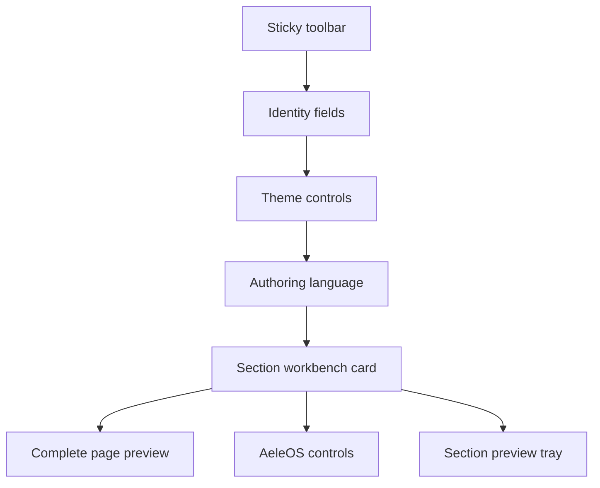

# A builder that stays itself while the page changes

- **Date:** 2026-08-21
- **Status:** Delivered 2026-08-23
- **Scope:** The signed-in fursona and person editors. No public-page renderer
  change except what is required to share the same `themeCss` declarations
  under a preview host.
- **Audience:** People composing a page in `apps/hub`.

## Context

The studio is powerful: nested containers, weighted places, skins, borders,
page themes, bilingual fields, drag. It is also easy to lose. The same card
that holds the mode select also inherits the section's skin variables; the
theme panel injects `themeCss` at `:root` and restyles the whole signed-in
page, including Save. A person picking "comic" or a magenta gradient cannot
tell whether they are looking at the page they will publish or at the tool
that builds it.

The public page already has the right split. Colours and the field live at
`:root` / `body`; skin tokens stop at `SKIN_SCOPE` on `PageShell`'s `<main>`;
the app bar stays AeleOS. The editor never got that split. It sits _inside_
`SKIN_SCOPE`, and opening the theme panel applies the author's theme to
everything.

This spec makes the editor chrome a stable AeleOS workbench. Author look
applies only inside labelled preview trays: one under each top-level section,
and one complete-page preview at the end of the form.

## Goals

1. A person can tell, at a glance, when they are using controls and when they
   are looking at the page.
2. Editor chrome does not change colour, skin, radius, or type when the
   author changes options.
3. Previews still use the real public renderer and the same `blockStyle` /
   `themeCss` declarations the stranger's page uses.
4. Keep the current editor geography: one vertical form, per-section cards,
   drag as an exchange of places, no outline pane and no wizard.
5. Add a complete-page preview that expands inline at the end of the form.

## Non-goals

- This does not change the block model, drag semantics, save path, or schema.
- This does not add a second renderer, a screenshot, or an iframe of the
  public route.
- This does not remount the nebula canvas inside a preview. App chrome keeps
  the app canvas; a preview paints `--field` (and a background picture) on
  its own box.
- This does not freeze which fields exist. Changing a leaf kind or a
  container mode still shows and hides the controls that kind needs. Those
  controls still look like AeleOS.
- This does not restyle the public page's chrome, and it does not change
  `themeCss` output for a public `ThemeScope`.
- This does not add a side-by-side inspector or a guided one-section wizard.

## Opening rule

**Controls are AeleOS. Previews are the author's page.**

AeleOS chrome uses the design tokens and `surface` utility. Author colour,
skin, section style, measure, bleed and background picture live only inside
a preview host. If a control's look changes when the author changes a skin,
a colour, or a section style, the split is broken.

## Information architecture

The editor stays one scrollable form:

1. Sticky toolbar (title, Cancel, Save) — already AeleOS; stays that way.
2. Identity fields (handle where it exists, display name, avatar URL,
   visibility).
3. Theme configurator — the controls remain; they stop painting the rest of
   the app.
4. Authoring-language strip, still above the sections.
5. Block editor: templates, then one workbench card per top-level section.
6. Complete-page preview, collapsed by default, at the end of the form.

### Section workbench card

Each depth-0 section is one card with two stacked regions:

- **Controls.** Grip, collapse, name, mode, spaces, shape, weights, style
  popup, places grid, nested leaf/container editors, add-place. Neutral
  AeleOS surface. No inherited `--skin-*` on this root. No painted section
  background on this root.
- **Preview tray**, only at depth 0. A labelled region ("Live preview" /
  existing `previewTitle`) wrapping the real `Block` from `blocks.tsx`,
  parsed with `lenientBlockSchema` as today. The tray is the host for
  inherited `blockStyle` variables, painted section style, and the page
  theme scoped to this subtree.

Nested cards (depth 1–2) are controls only. They have no preview tray. Their
look is the parent's workbench look, not the nested container's skin.

Collapse still hides the places grid and nested editors. The depth-0 preview
tray stays visible, as today, so collapsing a section is a way to look at
the page without the places.

### Complete-page preview

A disclosure at the bottom of the form, **collapsed by default**. Opening it
renders the whole `sections` tree through `PublicBlocks` (the same component
a stranger's route uses), inside a preview host that receives:

- live `PageContext` (the form's handle, display name, avatar, kind,
  addresses — the overlay `FursonaEditor` already builds)
- the form's current `theme`
- the authoring language, not the app locale

The host is a measured page box, not a phone iframe and not a new tab. It
expands inline. It is labelled as the complete page so it cannot be mistaken
for another section card.

It is bounded by the editor column, so it cannot reproduce public-route
viewport width or let a bled section reach the browser edge. That fidelity
limit is explicit: horizontal excess remains reachable with scrolling and is
never hidden to make the workbench look as though it fits. Container-query
behaviour remains real for the width the inline host actually has.

The complete preview lenient-parses each top-level draft block before handing
the readable members to `PublicBlocks`. One malformed mid-edit section
therefore disappears without taking down its valid neighbours or the editor.

It is not a second editor. Nothing inside it is draggable or editable.

## Theme isolation

Today `ThemeConfigurator` emits `` while the
panel is open. `themeCss` targets `:root`, `body`, and `.SKIN_SCOPE`. The
editor lives inside `SKIN_SCOPE`, so the author's skin and colours restyle
Save, the header, and every input.

**Public `themeCss` stays exactly as it is.** Colour still has to reach the
canvas and the field on a stranger's page; that is why those rules are on
`:root` and `body`. An earlier attempt to scope them to a nested `div`
failed for that reason (`ThemeScope`'s own comment). The editor is the
opposite problem: it _must not_ reach the canvas or the bar.

The editor therefore uses a **preview-scoped emitter**, same declarations,
different selectors:

| Public `themeCss`                        | Editor preview emitter                            |
| ---------------------------------------- | ------------------------------------------------- |
| `:root:not([data-page-theme="default"])` | the preview host                                  |
| that gate plus `body`                    | the preview host (field + background picture)     |
| that gate plus `.SKIN_SCOPE`             | `.SKIN_SCOPE` inside the host, or the host itself |

The preview host:

- is a client boundary around each tray and around the complete-page preview
- wears `SKIN_SCOPE` so skin tokens apply inside it
- is selected by a host attribute of its own (for example
  `data-preview-theme`), never by `.SKIN_SCOPE` alone — the form already
  sits inside `PageShell`'s `SKIN_SCOPE`, and a bare class selector would
  restyle the workbench
- paints `--field` as its own background, so a page background picture and
  gradient show in the tray without writing to `body`
- emits its author declarations unlayered, so they beat layered app defaults
  inside the host; selector containment is what protects the workbench

Every host intentionally shares one selector because an editor has one live
page theme. Different themes rendered side by side are not supported; that
future feature would require a unique selector per host.

`ThemeConfigurator` stops injecting a document-level `<style>` for live
preview. Dials still coalesce; they update the form value; the preview
hosts re-emit scoped CSS from that value. The rest of the signed-in page
keeps design tokens whether the panel is open or not.

`FursonaEditor` watches identity and theme only. `BlockEditor` already owns the
sections controller required by the editing controls, and a small complete-
preview controller owns the second sections subscription. A leaf edit therefore
does not rerender the toolbar, identity fields and theme panel merely to update
the complete preview.

A page that has a saved theme still does not theme the editor chrome when
the editor first loads. Only the trays wear it. Save remains the write;
live preview remains local to the hosts.

## Section style isolation

`block-card.tsx` already splits `blockStyle` into inherited custom properties
and painted properties. Inherited currently land on the card root; painted
land on the face layer. That is why a comic skin changes the inputs.

Move **both halves onto the preview tray** at depth 0:

- inherited `--*` on the tray host
- painted background / clip-path on the tray's inner face, not on the
  control card

The control card keeps a plain `surface` face so grips, selects and the
style popup stay readable. The popup still _edits_ `block.style` and still
previews with `blockStyle` — its own live swatch may keep using those
functions; the surrounding card may not inherit them.

This is the same ruling as `section-card-face.spec.ts`, inverted to the
right element: fidelity lives on the preview; controls sit on `--surface`
because they are not the page.

## What may still appear and disappear

Showing a URL field for a link and hiding it for a heading is not a theme
change. The workbench may:

- gate leaf fields on `leafFields(kind)`
- hide shape and weight dials unless `mode === "grid"`
- reflow the places grid when `spaces` changes
- append nested cards when a shape seeds containers

Those controls always use AeleOS tokens. The preview tray is what wears the
new layout.

Authoring language still switches which bilingual half is bound. The strip
and the inputs stay AeleOS; the preview text follows the authoring language.

## Dragging

Drag stays an exchange of places. Grips stay in the control region. A
preview tray is not a drop target: `placeUnderPointer` must not treat the
rendered `Block` as a place, or a pointer over the preview would collide
with public-page seats that have no editor path.

The complete-page preview is outside `DndContext` (or otherwise excluded
from collision), so opening it cannot steal a drag.

## Responsive behaviour

Editor cards keep container queries for their own header wrap (`@xl` on the
control card). Public renderer rules stay container queries inside the
preview. No new viewport breakpoints inside `blocks.tsx`.

The complete-page preview is a full-width tray in the same column as the
form. It is not a second column. Phone layout stays one column: controls,
then that section's preview, then the next card, then the page preview.

`responsive.spec.ts` must still fail an `overflow-x: hidden` cheat. A section
tray may clip its own painted corners, but the complete preview keeps horizontal
excess scrollable and the browser guard opens it at every narrow viewport.

## Embed privacy and duplicate mounts

The section tray's real `Block` mounts allowlisted third-party frames while the
author edits. Their request and the fact that this is an editing session
therefore reach the provider before publication. This is explicit and accepted:
an embed is exactly what the author needs to see working, and a placeholder
would be a second renderer with different privacy and playback behaviour.

Opening the complete preview mounts a second copy of any embed already present
in its section tray. The duplicate is temporary and user-initiated, and is
accepted for the same fidelity reason; closing the disclosure unmounts it.

## Copy and catalogues

New chrome strings (complete-page preview title, expand/collapse, and any
stronger labelling of the section tray) go in both next-intl catalogues.
A person's `name_es` is still not a missing-key fault.

Reuse `previewTitle` for the section tray if the existing string still
names what the region is. Do not invent a second word for the same job.

## Accuracy sources

When sources disagree:

- `apps/hub/src/features/actors/CLAUDE.md` for the block model and editor
  stack
- `blocks.tsx` / `PublicBlocks` for what a stranger sees
- `actor-theme.ts` `themeCss` for public selectors (unchanged)
- `section-card-face.spec.ts` for why controls need an opaque surface
- this spec for the editor split

## Verification

Before this is considered done:

1. Opening the theme panel and dragging every dial leaves the toolbar,
   identity fields, and section controls on design tokens. Sabotage:
   restore the `:root` `<style>` and watch the token assertion go red.
2. Changing a section skin, border, or background picture changes the
   section preview tray and does not change that card's inputs. Sabotage:
   put `rootStyle` back on the card wrapper.
3. The section preview and the complete-page preview render through
   `Block` / `PublicBlocks`, not a parallel tree. `block-card.test.tsx`
   still drives the real renderer.
4. Identity leaves in both previews follow the live form values.
5. Collapse hides places and keeps the section preview.
6. A pointer drag over the section preview does not highlight a public
   seat as a drop target.
7. `a11y.spec.ts` still runs axe on the editor; heading order must remain
   a workbench heading then a preview heading, not the inverse.
8. `personalised-page-cost.spec.ts` is re-run. Theme-dial invalidation
   should no longer restyle the whole editor DOM; if the ratio budget
   still holds, leave it. If isolation changes the distribution, measure
   twice on the good build and once sabotaged before touching the ceiling
   (CLAUDE.md rule 14).
9. `responsive.spec.ts` still covers the editor at every `VIEWPORTS` stop.
10. Both catalogues have every new key.

## What this deletes

The editor's document-level live `themeCss` injection. The card-root
inheritance of `blockStyle`. Any assumption in tests that opening the
theme panel restyles `:root` while editing.

It does not delete `ThemeScope` on public routes, the face-layer split as
a mechanism, or the per-section preview itself — it relocates them.

## Delivered corrections and measurements

The implementation kept the architecture above, with these measured
clarifications:

- `SectionPreviewTray` is a sibling of its top-level `BlockSlot`, not merely a
  child excluded by collision code. The complete preview follows `BlockEditor`,
  outside `DndContext`, and stays unmounted until its disclosure opens.
- A small complete-preview controller, rather than a top-level sections watch,
  subscribes the full preview to leaf edits. The permanent unit guard counts
  toolbar renders and fails if a leaf edit invalidates the whole editor.
- The complete preview is bounded by the editor column and uses reachable
  horizontal scrolling rather than clipping. Narrow browser coverage opens it
  at every phone viewport.
- The permanent browser guard records computed token and paint values for Save,
  the display-name input and a section-name input, then changes a non-default
  gradient, accent and skin. Both the section `Block` preview and the complete
  `PublicBlocks` preview change while all three controls stay byte-for-byte
  stable. Restoring document-level `themeCss` makes the toolbar comparison fail
  first.
- The drag guard first lights a legal editor place, then moves the pointer over
  a real section preview. No `data-over` marker or refusal is allowed there.
  Giving a preview that marker reddens the marker assertion.
- The accessibility fixture opens the complete preview under the existing WCAG
  A/AA scan and compares real headings in document order. `best-practice`
  remains off.
- Performance was measured on the same credentialed heavy-page fixture twice
  good and once with document-level `themeCss` restored. Good runs reported
  10,946 nodes, 15.2ms then 11.8ms style recalculation per delivered input,
  0.006 theme commits per movement in both runs, and 19.4% then 22.3% scroll
  busy. The sabotage reported 10,947 nodes, 47.0ms per input, 0.006 commits per
  movement and 21.9% scroll busy. The good spread (3.4ms) is separated from the
  sabotage by 31.8ms at its nearest edge, but every existing ceiling still
  holds with ample headroom; no threshold changed.
