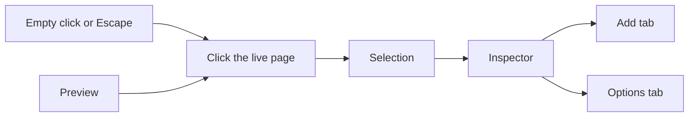

# Canvas-first builder with a hideable inspector

> **Superseded for inspector navigation (2026-09-01).**
> The canvas-first shell remains current, but this document's selected startup,
> Add/Options panes, fully mounted workbench tree and cross-level drag model do
> not. The current interaction contract is
> [`2026-09-01-recursive-inspector-drill-down-design.md`](2026-09-01-recursive-inspector-drill-down-design.md):
> startup is deselected; Page and containers expose shallow Items plus Options;
> leaves open Options directly; Back and breadcrumbs follow `BlockPath`; and
> only visible siblings in one Items scope are draggable. The historical body
> below is retained as delivered.

- **Date:** 2026-08-31
- **Status:** Superseded for inspector navigation
- **Scope:** The signed-in fursona and person editors. The stored page document
  does not change. Public pages change only by gaining inert `data-block-path`
  attributes used for editor selection.
- **Audience:** People composing a page in `apps/hub`.

## Context

The editor already wears the page (`2026-08-27-the-editor-wears-the-page-design.md`):
`ThemeScope` on the document, hide-controls that removes every `CHROME_SCOPE`
island, fidelity pinned by `editor-is-the-page.spec.ts`. What it still teaches
as the front door is the workbench: one card per section, mixing grip, mode,
spaces, weights, style popup, nested editors, and a labelled live-preview tray.

That vocabulary is the document. The author should meet the **page**, and reach
the vocabulary through an inspector that is not always on screen.

## What we keep

The stored page does not change. Containers, leaf kinds, modes (`stack`,
`grid`, `tabs`, …), spaces, weights, per-block style, required identity
blocks, bilingual fields, drag semantics (`moveBlock`), and the JSON source
dock stay. Freedom lives in the document.

Hide-controls stays the Preview path. It is not a second preview renderer.

## Authoring model

**The canvas is the page.** Click a section, a picture, a heading, or the Page
control in the toolbar. Selection is a light outline only — no control cards
stacked in the scroll.

**The inspector is not a permanent column.** It opens for the current
selection and closes when nothing is selected. It has two tabs:

- **Add** — what can be dropped _into this selection_ (page → sections and
  content; section → items that belong inside it; a leaf → nothing to nest, or
  “wrap in a layout”).
- **Options** — every control that already exists for that target (page
  identity and theme, section layout/mode/spaces/weights/style, leaf fields
  and style), in ordinary language.

Dropping Text or Picture onto the **page** still auto-wraps it in an unnamed
`stack` section so the stored model stays “sections at depth 0.” The author
never has to create that wrapper by hand.

## Two hide levels

1. **Look at the page** — click empty canvas or press Escape. Inspector,
   selection outline, and drop targets go away. A thin toolbar (Save,
   language, Preview, JSON, Page) stays.
2. **Preview** — the existing hide-controls control (`data-controls="hidden"`).
   Toolbar and every editing affordance go away; one way-back control remains
   in the header portal, as today.

On a phone the inspector is a dismissible **bottom sheet**, never a stuck
sidebar. Swipe-down is the sheet’s own dismiss; tapping empty canvas or
Escape still deselects. Preview still hides everything.

## What we stop exposing by default

Workbench cards in the scroll. Nested layout still exists; it is reached by
selecting a section and using Add/Options, or by pasting JSON.

Words like “container,” “leaf,” “spaces,” and “weights” stay in schema and
JSON. The inspector uses “layout,” “columns,” “this row,” “how wide each
column is.”

## Selection

- A **block** is selected by clicking the nearest ancestor that carries
  `data-block-path` (the public renderer’s own wrappers). Innermost wins
  because `closest` walks up from the event target.
- The **page** is selected by the Page control, not by clicking empty
  canvas — empty canvas deselects. That split is load-bearing: one click must
  not mean both “I want page options” and “I want the inspector gone.”
  (That control was never in the toolbar, as this line used to say; it sat
  above the canvas, and since 2026-09-03 it rides inside it, which is why
  `onCanvasClick` exempts `CHROME_SCOPE`.)
- Escape deselects, except when the event target is a field inside the
  inspector (a colour input must not steal Escape from its own dismiss).
- Preview does not need to clear selection: hide-controls removes
  `CHROME_SCOPE`, and the outline is chrome.

## Auto-wrap

`wrapLeafOnPage` appends `{ kind: "container", mode: "stack", spaces: 1,
name_en: "", children: [leaf] }`. Empty `name_en` is unnamed: the public
renderer draws no heading. Depth 0 remains a container. The write schema and
`0009` do not change.

A page already at the block cap is a no-op (same array identity).

## Drag and add

Phase 1 does not rewrite `moveBlock`. Top-level section grips stay on the
canvas so a reorder is still a drag of the page, not of a card in a drawer.
Nested places stay in the selected section’s Options card — the same
`BlockCard` / `BlockSlot` tree, reached by selecting that section.

Phase 2: the Add tab’s items are draggable onto the canvas. A drop on the
page field wraps a leaf; a drop on a selected (or targeted) section adds
into it. Click-to-add is the same mutation as a drop, so a phone that cannot
drag still works.

## JSON dock

Remains a Braces control on the thin toolbar. It is the escape hatch for the
full vocabulary, not a second editor people are forced through.

## Non-goals

- No stored-page migration.
- No schema or `moveBlock` rewrite in phase 1.
- No second preview renderer.
- No per-block colour (already refused).
- No teaching `container` / `leaf` / `spaces` / `weights` in the inspector
  copy.

## Proof

`editor-is-the-page.spec.ts` stays the fidelity proof for Preview. New cases
pin: inspector absent until select, gone on deselect and Escape, gone under
Preview, Add wrapping a leaf on the page as an unnamed stack.
